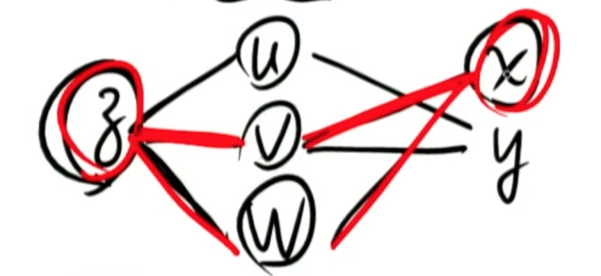

# 第四讲 多元函数微分学 Multivariable Differential Calculus
* 概念，计算，应用(极、最值) 

##一、概念
###1.极限
* $$设f(x,y)的定义域为D，P_0(x_0,y_0)是D的聚点，\\ \forall \varepsilon > 0, \exists \delta > 0, 当P(x,y) \in D \cap 去心u(P_0,\delta)时，\\恒有|f(x,y)-A| < \varepsilon \Rightarrow \\ \lim_{x \to x_0, y \to y_0}f(x,y)=A$$ 
    $$聚点的概念:理解为内点+边界点，但边界点不一定是D的$$

###2.连续性
* $$若\lim_{x \to x_0, y \to y_0}f(x,y)=f(x_0,y_0),称f(x,y)在(x_0,y_0)连续$$
    * $$[注]若"≠",叫不连续，不讨论间断类型$$
    
###3.偏导数（必考）————偏的意思是片面，偷懒
* $$z=f(x,y)$$
* $$ \frac {\partial f}{\partial x}|_{(x_0,y_0)}= f_x'(x_0,y_0) \triangleq \lim_{\Delta x \to 0  } \frac {f(x_0+\Delta x,y_0)-f(x_0,y_0)}{\Delta x}$$
* $$\frac {\partial f}{\partial y}|_{(x_0,y_0)}=f_y'(x_0,y_0) \triangleq \lim_{\Delta y \to 0  } \frac {f(x_0 ,y_0+\Delta y)-f(x_0,y_0)}{\Delta y}$$
* $$ \partial  偏微分符号，拉格朗日发明，法文，读音类似round$$

##二、计算(必考)————多元函数微分法
###1.链式求导规则 
* $$设 z=f(u,v,w),u=u(y),v=v(x,y),w=w(x),\\称x,y叫自变量,u,v,w叫中间变量,z叫因变量$$
* $$复合变量结构图$$

* 有几条路就有几项相加，每条路上有几段就有几个相乘
* $$\frac {\partial z}{\partial x} = \frac {\partial z}{\partial v} \bullet \frac {\partial v}{\partial x} + \frac {\partial z}{\partial w} \bullet \frac {dv}{dx}$$
    * $$w 到 x 只有一条，所以用\frac {dv}{dx} 不用 \frac {\partial v}{\partial x}$$
* 注意书写规范

###2.高阶偏导数
* $$设 z=f(u,v,w),u=u(y),v=v(x,y),w=w(x),\\称x,y叫自变量,u,v,w叫中间变量,z叫因变量$$
* 四种二阶偏导数
    * $$ \frac {\partial(\frac {\partial z}{\partial x})}{\partial x} = \frac {\partial^2 z}{\partial x^2} $$
    * $$ \frac {\partial(\frac {\partial z}{\partial x})}{\partial y} = \frac {\partial^2 z}{\partial x \partial y } $$
    * $$ \frac {\partial(\frac {\partial z}{\partial y})}{\partial x} = \frac {\partial^2 z}{\partial y \partial x} $$
    * $$ \frac {\partial(\frac {\partial z}{\partial y})}{\partial y} = \frac {\partial^2 z}{\partial y^2} $$
* 无论z对谁求导，也无论z已经求了几次导，新函数仍然与原来函数有完全相同的复合结构

* [自注]这段没有看明白，到知乎上查了下，解释如下
    * 1.偏导数是相对某个具体的坐标系才有意义的
    * 2.链式法则是对复合函数才适用  
* [自注]这里我的理解是所谓中间变量其实是“坐标系的基”，结合线性代数就好理解了。
    * 而链式法则一开始就是在转换坐标系，机器人学里的链式法则也是在转换坐标系，所以链式法则只能用于复合函数
    * 所以那句“无论求了几次导……”就好理解了，不管怎么求导，也不会改变坐标系的基的，因为在过程中转换坐标系完成求导，但是最终结果还是在原坐标系

###3.多元函数的极最值（必考）
* 概念理解
* $$ f(x,y) < f(x_0,y_0) 真正,f(x,y) \le f(x_0,y_0) 广义$$

* $$1.无条件极值 z=f(x,y)$$
    * 1.必要条件
        * 设
