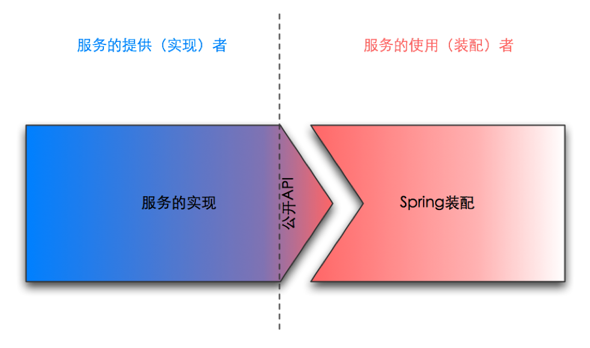

# Webx框架指南
#### 引言
Webx是一套基于Java Servlet API的通用Web框架。它在Alibaba集团内部被广泛使用。从 2010年底,向社会开放源码。

#### 第一章

框架的本质就是“扩展”。
维基百科这样定义描写“软件框架”,它说一个软件框架必须符合如下要素:

| 要素 | 解释 |
|:-- |:-- |
| Inversion of Control 反转控制 | 应用的流程不是由应用控制的,而是由框架控制的。 |
|Default Behavior 默认行为 | 框架会定义一系列默认的行为。 |
| Extensibility 扩展性 | 应用可以扩展框架的功能,也可以修改框架的默认行为。|
| Non-modifiable Framework Code 框架本身不可更改 | 框架在被扩展时,自身的代码无须被改变。 |
  
* 在一个框架中,实现丰富的功能固然重要,然而更重要的是:建立良好的扩展机制。
* 一个Web框架的好坏,往往不是由它所实现的具体功能的好坏决定的,而是由其所用的基础框 架的好坏决定的。
* 设计良好的模块,应该是层次化的。
  * 上层定义规则,下层定义细节;(上层、下层也可称为内层、外层)
  * 上层是抽象的,下层是具体的;
  * 越上层,越稳定(越少改变);越下层,越易变。
  * 依赖倒转(Dependency Inversion)。下层(具体)依赖上层(抽象),而不是上层依赖下层。
  * 下层扩展上层时,不需要修改到上层的任何代码和配置。即符合开闭原则(Open-Closed Principle简称OCP – Open for extension, Closed for modification)。
  * 每一层均可被替换。
* 层次化不是自然而然的,而是需要精心的设计。
  * 切分功能。每个组件专心做一件事。
  * 分析哪些会改变,哪些不会改变。不变部分固化在组件中,可能会改变的部分抽象成接口,以便扩展。
  * 考虑默认值和默认扩展。默认值和默认扩展应该是最安全、最常用的选择。对于默认值和默认扩展,用户在使用时不需要额外的配置。

* Webx框架不仅鼓励层次化设计,它本身也是层次化的。你既可以使用全部的Webx框架,也可 以只使用部分的Webx框架。大体上,Webx框架可以划分成三个大层次。
  * SpringExt:基于Spring,提供扩展组件的能力。它是整个框架的基础。
  * Webx Framework:基于Servlet API,提供基础的服务,例如:初始化Spring、初始化日志、接收请求、错误处理、开发模式等。Webx Framework只和servlet及spring相关——它不关心Web框架中常见的一些服务,例如Action处理、表单处理、模板渲染等。因此,事实上,你可以用Webx Framework来创建多种风格的Web框架。
  * Webx Turbine:基于Webx Framework,实现具体的网页功能,例如:Action处理、表单 处理、模板渲染等。

* 通过pipeline, 理论上可以实现任何框架的功能。
* Webx框架是一个稳定、强大的Web框架。倒不是说它实现了所有的功能,而是它建立在 SpringExt的基础上,具有超强的扩展能力。你可以使用全部的Webx,也可以使用部分Webx。 你也可以比较容易地用SpringExt做出自己的可扩展组件。
#### 第二章 SpringExt
* Webx是一套基于Java Servlet API的通用Web框架。Webx致力于提供一套极具扩展性的机 制,来满足Web应用不断变化和发展的需求。而SpringExt正是这种扩展性的基石。SpringExt扩 展了Spring,在Spring的基础上提供了一种扩展功能的新方法。
* 2.1. 用SpringExt装配服务
  * 2.1.1. Spring Beans
  * 在Spring 2.0以前,你只能装配beans,就像下面这样:
  ```xml
  <bean id="resourceLoadingService" class="com.alibaba...ResourceLoadingServiceImpl">
  <property name="mappings">
        <map>
            <entry key="/file" value-ref="fileLoader" /> <entry key="/webroot" value-ref="webappLoader" />
        </map>
    </property>
</bean>
<bean id="fileLoader" class="com.alibaba...FileResourceLoader"> <property name="basedir" value="${user.home}" />
</bean>
<bean id="webappLoader" class=" com.alibaba...WebappResourceLoader" />
  ```
    * 以上是一个典型的Spring beans的配置方案。这种方案简单易行,很好地体现了Spring的基 础理念:IoC(Inversion of Control,依赖反转). ResourceLoadingServiceImpl并不依赖 FileResourceLoader和WebappResourceLoader,它只依赖它们的接口ResourceLoader。
    * 
    *  如图所示。虚线左边代表“服务提供者”的职责,虚线右边代表“服务使用者”(即“装配
     者”)的职责。
    * 从图中可以看到,Spring的配置文件会依赖于服务实现类的公开API。装配者除非查看源代码 (如ResourceLoadingServiceImpl的源码)或者API文档才能精确地获知这些API的细节。这 有什么问题呢?
      * 没有检验机制,错误必须等到运行时才会被发现。装配者仅从spring配置文件中,无法直观地 了解这个配置文件有没有写对?例如:应该从constructor args注入却配成了从properties注 入;写错了property的名称;注入了错误的类型等等。
      *  无法了解更多约束条件。即使装配者查看API源码,也未必能了解到某些约束条件,例如:哪 些properties是必须填写的,哪些是可选的,哪些是互斥的?
      *  当服务的实现被改变时,Spring配置文件可能会失败。因为Spring配置文件是直接依赖于服务 的实现,而不是接口的。接口相对稳定,而实现是可被改变的。另一方面,这个问题也会阻碍 服务提供者改进他们的服务实现。
      *  难怪有人诟病Spring说它只不过是用XML来写程序代码而已。
*  2.1.2. Spring Schema
  *  这种情况直到Spring 2.0发布以后,开始有所改观。因为Spring 2.0支持用XML Schema来定义 配置文件。同样的功能,用Spring Schema来定义,可能变成下面的样子:
      ```xml
    <resource-loading id="resourceLoadingService" xmlns="http://www.alibaba.com/schema/services/resource-loading">
<resource pattern="/file">
<file-loader basedir="${user.home}" />
</resource>
<resource pattern="/webroot">
        <webapp-loader />
    </resource>
</resource-loading>
      ```
  * 这个配置文件是不是简单很多呢?和直接使用Spring Beans配置相比,这种方式有如 下优点:
  * 很明显,这个配置文件比起前面的Spring Beans风格的配置文件简单易读得多。因 为在这个spring配置文件里,它所用的“语言”是“领域相关”的,也就是说,和 ResourceLoadingService所提供的服务内容相关,而不是使用像bean、property这样的编 程术语。这样自然易读得多。
  * 它是可验证的。你不需要等到运行时就能验证其正确性。任何一个支持XML Schema的标准 XML编辑器,包括Eclipse自带的XML编辑器,都可以告诉你配置的对错。
  * 包含更多约束条件。例如,XML Schema可以告诉你,哪些参数是可选的,哪些是必须填 的;参数的类型是什么等等。
  * `服务的实现细节对装配者隐藏。`当服务实现改变时,只要XML Schema是不变的,那么 Spring的配置就不会受到影响。
* 所有的schema都会有一个“解释器”和它对应(即BeanDefinitionParser)。这个解 释器负责将符合schema定义的XML配置,转换成Spring能解读的beans定义。解释器是由服务 的开发者来提供的 —— 在本例中,ResourceLoadingService的开发者会提供这个解释器。
* 
* 如图所示,虚线右侧的装配者,不再需要了解服务具体实现类的API,它只要遵循标准的XML Schema定义来书写spring配置文件,就可以得到正确的配置。这样一来,虚线左侧的服务提供 者就有自由可以改变服务的实现类,他相信只要服务的接口和XML Schema不改变,服务的使 用者就不会受影响。
* 将和具体实现相关的工作,例如提供类名、property名称和类型等工作,交还给服务的提供 者,使服务的使用者(即装配者)可以用它所能理解的语言来装配服务,这是Spring Schema 所带来的核心价值。
* Spring Schema有一个问题 —— 它是不可扩展的。


 


